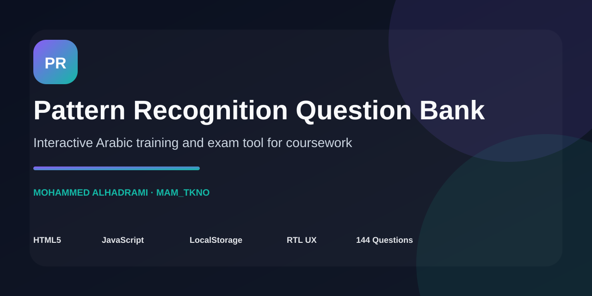
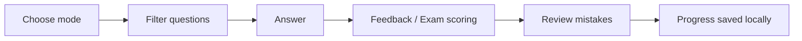

# Pattern Recognition Question Bank — بنك أسئلة تمييز الأنماط




**Interactive Arabic training and exam tool for Pattern Recognition coursework.**

[Application](index.html)

Interactive Arabic study application for Pattern Recognition coursework.

## Portfolio Proof

| Area | Evidence |
|---|---|
| **Problem** | Large course question sets are difficult to practice efficiently as static notes. |
| **Solution** | A single-page Arabic study tool with training/exam modes, filters, mistake review, and persistent progress. |
| **Implementation** | [index.html](index.html) |
| **Question scope** | 144 questions across lectures 1, 3, 4, 6, 7, and 8. |
| **Persistence** | Browser `localStorage`; no account or backend required. |
| **Current status** | Portable static application that can run locally or on static hosting. |

## Features

- 144 questions across lectures 1, 3, 4, 6, 7, and 8.
- Training mode with immediate feedback.
- Exam mode with scoring at the end.
- Filtering by question type.
- Review of incorrect answers.
- Automatic progress saving with localStorage.
- Responsive Arabic interface.
- Static application with no backend required.

## Tech Stack

HTML5 · JavaScript · LocalStorage · Responsive RTL UI

## Learning Flow



## Run Locally

```bash
python3 -m http.server 4173
```

Then open `http://localhost:4173`.

## Structure

```text
.
├── index.html
└── README.md
```

The project demonstrates how academic material can be converted into a practical interactive study tool with assessment modes and local progress persistence.
